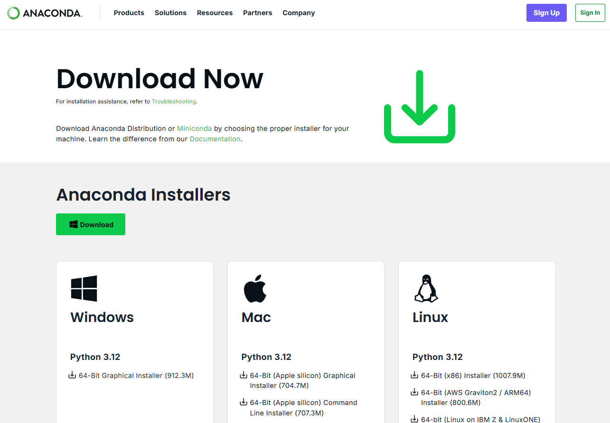
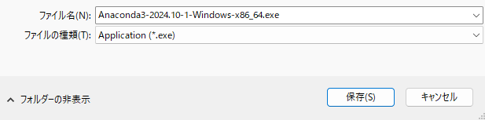
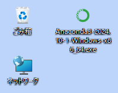
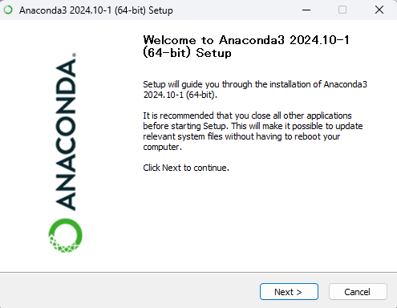

# README

（プログラムファイルをお使いになる前にお読みください）

友原章典著『文系のためのPythonデータ分析』（2024年，有斐閣）のサポートデータです。
本文と章末練習問題の解答例を用意しています。

## フォルダ構成

- `exercise` ……章末練習問題の解答例のファイルです。
- `images` ……このページで表示している画像ファイルです。
- `notebook` ……本文の各章で使用するファイルです。

## 環境

提供するプログラムファイルは、以下の環境で問題なく動作することを確認しています。

- Windows 11
- Python 3.11.1

## Anacondaのインストール方法

1. Anacondaの公式サイトの[ダウンロードページ](https://www.anaconda.com/download/success)へアクセス

    

1. 緑色のダウンロードボタンをクリックして、実行ファイル（exe）をダウンロード

    

1. ダウンロードしたファイルをダブルクリックするとセットアップ画面が立ち上がる

    

1. 各画面で`next`をクリックしてインストール

    


## Anaconda Navigatorを使用しないセットアップ方法


### Jupyter Notebook上で実行する方法

ノートを開いた状態で、セルに下記のコマンドを貼り付けて実行（Ctrl+Enter）すると、本書のコードを実行するために必要なライブラリが一括でインストールされます。

```
!python -m pip install japanize_matplotlib matplotlib mecab-python3 networkx numpy openpyxl pandas plotly pulp scikit-learn seaborn unidic wordcloud
!python -m unidic download
```


### コマンドプロンプトから実行する方法（上級者向け）

Windows環境下で既にPythonの環境が整っている場合、下記のコードをコマンドプロンプトから実行することで必要なライブラリを一括でインストールすることができます。

下記のコマンドでJupyter Notebook自体もインストールされるので、Anacondaを追加でインストールする必要はありません。

```
python -m pip install japanize_matplotlib jupyter matplotlib mecab-python3 networkx numpy openpyxl pandas plotly pulp scikit-learn seaborn unidic wordcloud
python -m unidic download
```

## 既知の問題

#### 第10章 演習問題 問3

2024年10月の本書刊行時点では出力結果が `111.68012704719584` でしたが、その後のライブラリ等のアップデートにより、現在（2025年5月時点）は `np.float64(-33.55962557420356)` が出力されます。

## 免責事項

プログラムファイルの作成にあたっては、内容に誤りのないようできる限り注意を払いましたが、結果生じたこと（損害等）には、著者、出版社とも責任を負うことはできませんので、ご了承ください。

2024年10月　株式会社有斐閣　書籍編集第2部
